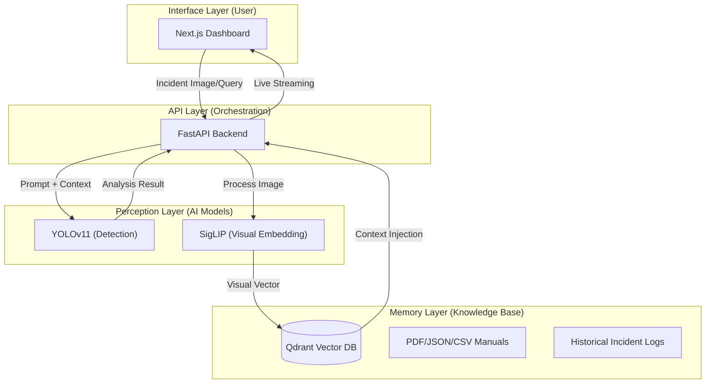

# 🛠️ Fix-It Felix: AI-Powered Rail Safety System v2.0

Fix-It Felix is an advanced research project designed to automate railway infrastructure inspection. It leverages Computer Vision and Multimodal **RAG (Retrieval-Augmented Generation)** to detect track defects and provides real-time regulatory advice to ensure operational safety.

## 🎯 Project Objectives

- **Automated Inspection**: Reduce human error in identifying track defects.
- **Resilient AI**: Use Multimodal RAG to maintain accuracy during low-visibility conditions (snow, fire, ...).
- **Privacy & Speed**: Provide a hybrid inference model that toggles between cloud-based performance and local-first privacy.
- **Knowledge Integration**: Bridge the gap between visual data and technical safety manuals.

## 🛠️ Technologies Used

### Backend
- **Python 3.10+** (Core Logic)
- **FastAPI** (High-performance API layer)
- **Qdrant** (Vector Database for RAG and Long-term Memory)
- **YOLOv11** (Real-time Object Detection)
- **SigLIP** (Visual Embedding via Vision-Language Pre-training)
- **Ollama (Llama 3.2 1B)** (Local LLM Inference)
- **FastEmbed** (Lightweight text embedding)
- **PyTorch** & **Transformers** (Model execution)

### Frontend
- **Next.js 14+** (React Framework)
- **TypeScript** (Type safety)
- **Tailwind CSS** (Industrial UI/UX)
- **Lucide React** (Iconography)

## 🏛️ Project Architecture



## 🧠 Qdrant Integration: Multimodal RAG

Qdrant is the core "brain" of Fix-It Felix, acting as a high-speed retrieval engine for both visual and textual knowledge.

### Multi-Lane Vector Search
The system implements a dual-lane search strategy in Qdrant:
1. **Offline Lane (SigLIP 768d)**: High-resolution visual vectors used for deep historical matching.
2. **Fast Lane (Matryoshka 1536d)**: Sliced embeddings optimized for rapid, low-latency search on edge devices.

### Knowledge Collections
- **`rail_safety_logs`**: Stores visual embeddings of past incidents paired with their outcomes.
- **`expert_knowledge`**: Stores vectorized technical manuals (PDF), safety regulations (TXT), and CSV logs.

### RAG Flow
When a new incident is reported:
1. An embedding is generated for the uploaded image using **SigLIP**.
2. **Qdrant** performs a similarity search against `rail_safety_logs`.
3. If a match is found (score > 0.75), the historical solution is injected into the prompt context for the LLM/Detector.

## 🚀 Setup and Installation

### 1. Prerequisites
- Python 3.10+
- Node.js 18+
- [Ollama](https://ollama.com/) (for local Llama 3.2 model)
- Qdrant (Runs locally via `qdrant-client` path or Docker)

### 2. Backend Installation
```bash
# Clone the repository
git clone https://github.com/Ahmed-Hedhili-se/Fix-It-Felix.git
cd fix_it_felix

# Install dependencies
pip install -r requirements.txt

# Download YOLO weights
# Ensure yolo11n.pt is in the root directory

# Ingest data into Qdrant
python bulk_ingest.py
```

### 3. Frontend Installation
```bash
cd frontend
npm install
npm run dev
```

### 4. Running the Application
```bash
# Start the Backend (from root)
python backend_api.py

# Access the UI at http://localhost:3000
```

## 📖 Usage Examples

### Automated Defect Detection
1. **Upload**: Drag an image of a railway track into the "Image Uploader".
2. **Select Mode**: Choose between **Cloud** (GPT-4o), **Private** (Local LLM), or **Offline** (Binary Quantized).
3. **Analyze**: Click "Run Infrastructure Diagnostic".
4. **Result**: The system detects issues (e.g., "Broken Rail") and retrieves specific safety advice from the Qdrant-backed knowledge base.

---
*Created by the Fix-It-Felix Development Team. Built for the Rail Safety Global Challenge.*
          (marbou7a nchlh)
